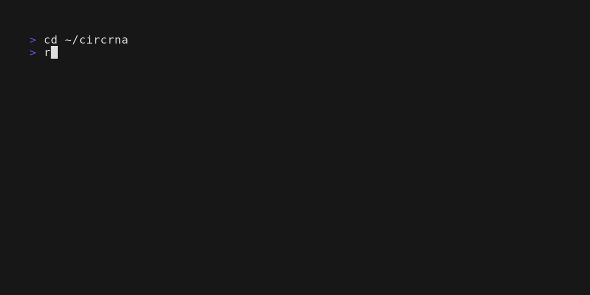

# RefTrace

<p align="center">
  <a href="https://github.com/reftrace/reftrace/releases"></a>
  <a href="https://discord.gg/kK7hVKXHQ3"></a>
</p>

Code analysis tool for bioinformatics pipelines.  
Currently supports linting for Nextflow pipelines.  
See https://reftrace.com and [📺 Watch a 2 minute tutorial](https://customer-rmcf6d3u09leya5y.cloudflarestream.com/eec7ef6db680b66733045242c9d1cb43/watch).

## Features

- Write custom linting rules in a Python-like language.
- Avoid parsing the Nextflow DSL.
- Deploy as a static binary.

## NF Core Linting Rules



```
reft lint nfcore
```
This runs a pre-defined set of linting rules that check for common issues in NF Core pipelines.
No `rules.py` file is required.  
No network access is required by default.  
No files are changed by default.

### Built-in Rules

- Check process labels
- Check container URLs

## Example Custom Rule

```python
# This file should exist in the root of your pipeline directory
def has_label(directives):
    return len(directives.label) > 0

def has_cpus(directives):
    return len(directives.cpus) > 0

def rule_has_label_or_cpus(module):
    for process in module.processes:
        if not (has_label(process.directives) or has_cpus(process.directives)):
            fatal("process %s has no label or cpus directive" % process.name)
```

## Download

Download the latest version for your OS from the [Releases](https://github.com/reftrace/reftrace/releases) page. Put it in your `PATH` so that you can run it as `reft`.

If you're on a Mac:

```bash
curl -LO https://github.com/reftrace/reftrace/releases/latest/download/reft-darwin-arm64
chmod +x reft-darwin-arm64
sudo mv reft-darwin-arm64 /usr/local/bin/reft
```

or on Linux:

```bash
curl -LO https://github.com/reftrace/reftrace/releases/latest/download/reft-linux-amd64
chmod +x reft-linux-amd64
sudo mv reft-linux-amd64 /usr/local/bin/reft
```

## Quick Example

```bash
./reft lint -d example_linting_rules/example_process.nf -r example_linting_rules/min_max_cpus.py
```

Outputs:

```
Rule: check_cpu_directive
  Module: /home/andrew/reft-pub/example_linting_rules/example_process.nf
    Error: Process FOO has an invalid CPU value. It should be >= 2 and <= 96, but it is 100

``` 

## Usage

### Command

The primary command for this tool is `lint`, which can be used as follows:

```bash
reft lint [flags]
```

### Flags

- `-r, --rules`: Path to the rules file (default is `rules.py`).
- `-d, --directory`: Directory to lint (default is the current directory `.`).
- `-n, --name`: Name of a single rule to run (optional).

### Example

To lint the current directory using the default `rules.py` file:

```bash
reft lint
```

To lint a specific directory with a different rules file:

```bash
reft lint -d /path/to/dir -r /path/to/custom_rules.py
```

To run a specific rule by name:

```bash
reft lint -n rule_name
```

### Example rules.py

```python
# This file should exist in the root of your pipeline directory
def rule_check_cpu_directive(module):
    for process in module.processes:
        cpu_directives = process.directives.cpus
        if not cpu_directives:
            # No CPU directive, so we skip this process
            return
        
        for cpu_directive in cpu_directives:
            cpu_value = cpu_directive.num
            if cpu_value < 2 or cpu_value > 96:
                fatal("Process %s has an invalid CPU value. It should be >= 2 and <= 96, but it is %d" % (process.name, cpu_value))
```

## Example Linting Rules

See the [example linting rules](example_linting_rules) directory. See the [API reference](https://reftrace.com/reference/linting_api/). A small tutorial can be found [here](https://reftrace.com/guides/nextflow_linting_examples).  

## Building

You need Go.

```
go generate ./...
go build -o reft
```

Dependencies are vendored. The Go ANTLR target is patched to fix a bug. The ANTLR-generated parser is also patched by [generate_parser.go](cmd/generate_parser.go).

Getting licenses of dependencies:

```
go-licenses save . --save_path="licenses"
```

### Adding a new dependency

```
go get <package>
go mod vendor
git restore vendor/github.com/antlr4-go/antlr/v4/lexer.go  # dependency we patched
```

## Adding NF Core Linting Rules

The code is in the [nf/corelint](nf/corelint) directory. The entrypoint is [nf/corelint/lint.go](nf/corelint/lint.go).

### Run the NF Core Linting Rules Tests With Coverage

```
go test -coverprofile=coverage.out ./nf/corelint
go tool cover -html=coverage.out
```
This will run the tests and open the coverage report in your browser.

## Limitations

- Not all parts of the Nextflow DSL are yet exposed. Specifically, only processes are handled. Only directives, process inputs, and process outputs are exposed to linting rules.

- The parser is not perfect. It doesn't seek to handle all of Groovy, but enough to work in practice. Even so, test coverage could be better. If you encounter a
parsing bug, please open an issue.

## Testing

The test data is in a separate repository: [reftrace/reft-testdata](https://github.com/reftrace/reft-testdata).
The Go tests assume you've cloned that to `~/reft-testdata`.

```
go test ./...
```

There are two sets of tests: `reft-go/nf` tests the exposing of the Nextflow DSL to linting rules. `reft-go/parser` tests the underlying Groovy parser.

## Acknowledgements

We would like to express our gratitude to the following:

- The [Apache Groovy](https://groovy-lang.org/) project.
- The [ANTLR](https://www.antlr.org/) project, for providing the parser generator used in this tool.
- The [Starlark](https://github.com/google/starlark-go) project, for the embedded scripting language used in our linting rules.
- The Go programming language and its standard library.
- The [Nextflow](https://www.nextflow.io/) project and community, for being so welcoming and helpful.

## License

This project is licensed under the Apache License, Version 2.0. See the [LICENSE](LICENSE) file for details. You may use the `reft --license` command to view the license.

